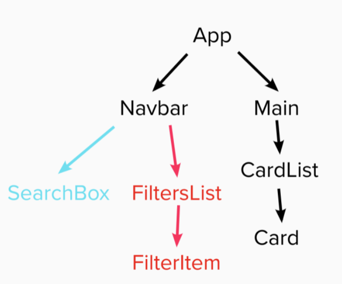
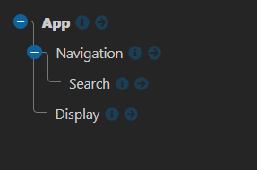

# Feedback

Hey Charlie here, feel free to message me on Slack if you want any clarification on the points below. I will give you both positive and constructive feedback on your project.

---

## Requirements

- Should be built in React - DONE
- Use the Punk API (after using the data file first)
  - Data - DONE
  - API - ALMOST DONE
- Test where possible (RTL) - NOT DONE
  - Covered later on in the course, give it a go when you have time
- Repository on GitHub - DONE

### Start

> "All the wireframe content in black is the first part of the challenge - that is, the sidenav, the main section containing the beers and beer cards for each piece of data. The component tree is below to help you get started."

Below I have the component tree from the brief and your component tree.





You are missing a couple of components from the brief. I understand that it may seem overkill to have the `<Main/>`, `<CardList/>`, `<Card/>`, `<FilterList/>` and `<FilterItems/>` components.

The reason why we have them in the brief is to force you to think in terms of components we also want to make you pass data with props.

It is important to think about how you break a project into small reusable components, this is how you build large applications. When you have components you need to know how you can get props through multiple components. From the top to the bottom.

I am can see you understand props as you have demonstrated it getting values from the `<App/>` to the `<Navigation/>` then to the `<Search/>`.

When you have some time try introducing the components that you have missed out.

### Extension 1

> Once you've got the design and layout sorted to render the elements, it's time to add some search functionality. Make it so you can search the beers by their name, and the page content should update as you type each letter in the box.

The aim of this extension is to get you using functions as props. You have smashed it, `handleInput()` in your app is being passed multiple component levels to your `<Search/>` component. That component is using the function to capture the user input and you are storing it in the App state.

You can remove `<p>{searchText}</p>` in the app. This was just to demonstrate that you have the search term in the app.

You are then able to use the value to filter the beers you import from the data file. This is great!

```jsx
// App.jsx
// LINES 60 - 64

// THIS IF BLOCK
if (beersLower.includes(searchTextLower)) {
  return true;
} else {
  return false;
}

// CAN BE REPLACED WITH BELOW

// .includes() WILL GIVE YOU TRUE / FALSE -> YOU CAN JUST RETURN THIS FROM YOUR FILTER
return beersLower.includes(searchTextLower);
```

**Side note**

To get the API working you need to store the value you get back to state.

```jsx
const getBeer = async () => {
  const response = await fetch(url);
  const data = await response.json();
  // ADD IT TO STATE
  setBeers(data);
};
```

Then when you preform your filter use the `beers` state rather then the `beer` data file.

```jsx
// App.jsx

const filteredBeers = beer.filter(() => {// YOUR FILTER FUNCTION})

// SHOULD BE

const filteredBeers = beers.filter(() => {// YOUR FILTER FUNCTION})
```

### Extension 2

> Finally attempt to make it so you can filter the content on three conditions:
>
> - High Alcohol (ABV value greater than 6%)
> - Classic Range (Was first brewed before 2010)
> - High Acidity (pH lower than 4)

You have taken the alternative approach to adding the filters and it does work which is great :). You have toggles in the app to know if you want to apply the filter or not. This is good, you pass the handle functions to the components that need them. Each one has its own function.

This is working with the ph ,abv and search term. There is a problem with the classic range. I have refactored and suggested a solution below.

```jsx
const filteredBeers = beers.filter(beer => {
  const beersLower = beer.name.toLowerCase();
  const searchTextLower = searchText.toLocaleLowerCase();
  // YOU CAN COMBINE STATEMENTS WITH &&
  // THIS READS BETTER THEN NESTED IF STATEMENTS
  if (phAcidic && beer.ph < 4) {
    return false;
  }

  if (abvValue && beer.abv > 6.0) {
    return false;
  }

  // YOU ARE CURRENTLY COMPARING THE MM/YYYY TO SEE IF IT IS GREATER THEN YYYY
  // THIS MEANS YOU WOULD TRY "09/2007" > "2010" THIS WOULD RESULT IN TRUE
  // YOU WANT TO COMPARE THE YEAR, THE YEAR IS ALWAYS THE LAST 4 IN THE STRING
  // YOU CAN USE .slice(-4) TO GET THE LAST 4 TO COMPARE
  if (firstBrewed && beer.first_brewed.slice(-4) > "2010") {
    return false;
  }

  return beersLower.includes(searchTextLower);
});
```

### Extension 3

> Style the website however you see fit! Go wild!

You have added some basic styles that really work. The fixed nav is nice and works well when you have all 25 beers displayed from the API. I can see that you have prioritized the functionality which makes sense, when you have time come back and style it for smaller devices :).

---

## The App

### Positive

- It displays the content on desktop and matches the wire frame basic layout.
- I like the colors you are using, that orange is great.
- With a couple of tweaks you have all of functionality that was requested.
- It is dynamic and responding to the user interacting with it.

### Constructive

- I think you will want to add a couple of small touches to finish it off.

- Update the readme.md so it is not the auto generated file.
  - What was the brief? What is the link to the live site?
  - [Markdown in 10mins](https://www.markdowntutorial.com/)
- Give the project a name and add a heading to the app, so it obvious what the project is.

---

## The Code

### Positive

- You have multiple functions being passed across your application to the components that need them.

- You are utilizing the power of conditional state to apply your filters.

  - With a couple of tweaks they work like a dream.

- I feel confident with your understanding of props, useState, useEffect and funcs as props.

- You do not have any warnings in the console :)

- Awesome good going! I can't wait to see what you build next.

### Constructive

I am not sure how confident I feel about you being able to create components.

Your `<Display/>` component could be split to match the `<Card/>` and `<CardList/>` components.

We do this so we are able to re use them, we have two different jobs.

- `<Card/>` displays the information for one.
- `<CardList/>` takes an array containing the information and is able to create multiples.

```jsx
// CardList.jsx
const CardList = props => {
  const { beers } = props;

  return (
    <div className="display">
      {beers.map(beer => {
        return (
          <Card
            key={beer.id}
            name={beer.name}
            description={beer.description}
            tagline={beer.tagline}
            imgURL={beer.image_url}
          />
        );
      })}
    </div>
  );
};
```

```jsx
// Card.jsx
const Card = props => {
  const { name, description, tagline, imgURL } = props;

  return (
    <div className="beer-card">
      
      <div className="beer-card__description">
        <h2>{name}</h2>
        <h3>{tagline}</h3>
        <p>{description}</p>
      </div>
    </div>
  );
};
```

Have a go at making more components. 

---
